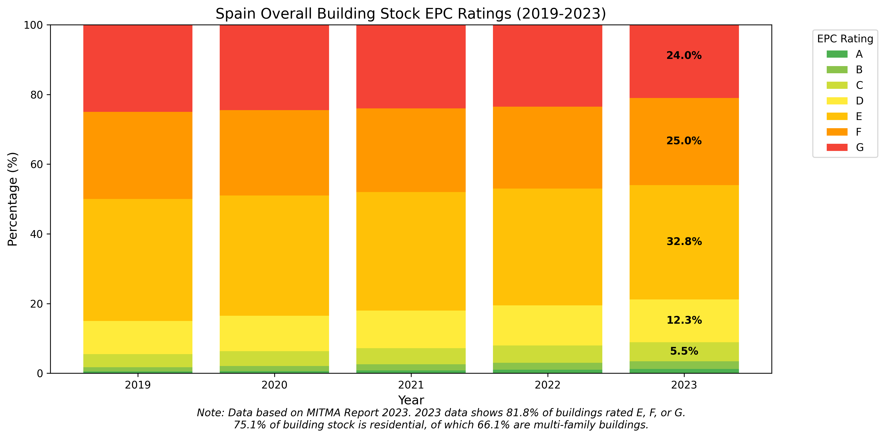

<!-- how can you make projections based on data about Spain meeting building efficiency EU goals
Here's a methodology for projecting Spain's progress toward EU building efficiency goals: -->

# Análisis de Eficiencia Energética de Edificios en España

## Algunos datos clave sobre España y su parque de edificios

### CONSUMO ENERGÉTICO

#### Distribución Aproximada de la Energía Disponible Bruta en España frente a la UE27 por sector

En 2023, el 31,2% de toda la energía primaria consumida en España corresponde a edificios (en comparación con el promedio de la UE del 39,5%). La distribución en la participación de energía bruta disponible en España fue 42,3% petróleo/derivados, 19,8% gas, 9,6% nuclear y 25,7% renovables en 2023. Una participación récord para las renovables, contribuyendo al progreso de España hacia los objetivos de eficiencia de la UE ([Eurostat, 2024](https://ec.europa.eu/eurostat/statistics-explained/index.php?title=Energy_statistics_-_an_overview#Primary_energy_production)<!-- and [REE, 2024](https://www.ree.es/en/datos/publications/annual-report)  -->).

La distribución de la participación de la energía bruta disponible (también conocida como Consumo Interior Bruto o Suministro Total de Energía) muestra dónde se consume la energía dentro de la economía de un país. Es un punto de partida clave para comprender la eficiencia energética, ya que destaca qué sectores ofrecen el mayor potencial de ahorro.

Para España, la distribución es ampliamente similar a otras naciones desarrolladas de la UE, pero con algunas características específicas, particularmente una **menor participación industrial** y una **mayor participación del transporte**.

Según los datos completos más recientes de la Comisión Europea y otras fuentes (típicamente datos de 2022, ya que los desgloses detallados completos de 2023 aún se están finalizando), la distribución aproximada para España es la siguiente:

1. **Transporte:** **~40%**
   * Este es el sector de mayor consumo en España. Incluye transporte por carretera (coches, camiones), aviación, transporte marítimo y ferrocarril. La alta participación está influenciada por la importante industria turística de España (que requiere transporte aéreo y por carretera) y su papel como centro logístico para Europa.

2. **Industria:** **~25%**
   * Esto incluye la energía consumida por manufactura, construcción y minería. En comparación con el promedio de la UE, la participación industrial de España es ligeramente inferior, lo que refleja una estructura económica más centrada en servicios y turismo.

3. **Hogares (Residencial):** **~17%**
   * Esto cubre la energía utilizada en los hogares para calefacción, refrigeración, agua caliente, cocina y electrodomésticos.

4. **Servicios (Comerciales y Servicios Públicos):** **~15%**
   * Este sector incluye la energía utilizada en oficinas, tiendas minoristas, hoteles, restaurantes, hospitales e instituciones educativas. La fuerte economía de servicios y turismo de España contribuye significativamente a esta participación.

5. **Otros (incluidos Agricultura y Pesca):** **~3%**
   * Este es un sector más pequeño pero aún importante, que cubre el uso de energía en agricultura y pesca.

##### Fuente de Datos del Sector y Contexto

La fuente principal de estos datos es el **Manual Estadístico de Energía de la UE de la Comisión Europea** y la **base de datos ODYSSEE-MURE**, que es una herramienta clave para indicadores de eficiencia energética en la UE. El Instituto para la Diversificación y Ahorro de la Energía (**IDAE**) de España también proporciona datos nacionales detallados.

Para comparación, la distribución **promedio de la UE-27** es aproximadamente:
* Transporte: ~30-32%
* Industria: ~26-28%
* Hogares: ~26%
* Servicios: ~14-15%

Esta comparación muestra que el perfil energético de España se distingue por su **dependencia superior al promedio del transporte** y una participación correspondientemente menor para la industria y los hogares.

#### Distribución de Energía Bruta por Fuentes
La comparación de la distribución de fuentes de energía (a menudo llamada mix energético) entre España y la UE27 revela diferencias significativas, en gran parte debido a la geografía, la disponibilidad de recursos naturales y las decisiones políticas históricas.

Aquí hay una comparación basada en los últimos datos anuales completos (típicamente 2022 o 2023) para la **Producción Bruta de Electricidad**.

##### Resumen Ejecutivo

Las diferencias más notables son:
* **Combustibles Fósiles:** La UE27 depende fuertemente de una mezcla de **gas, carbón y petróleo**. España utiliza significativamente menos carbón que el promedio de la UE y ha eliminado la mayor parte de su propia producción de carbón.
* **Nuclear:** La participación de España en energía nuclear es cercana al promedio de la UE, pero esto es engañoso porque el promedio de la UE incluye países como Francia (~70% nuclear) y otros que la han eliminado por completo (por ejemplo, Alemania).
* **Renovables:** Ambos son líderes, pero sus carteras difieren. La UE27 tiene una participación masiva de **eólica y biomasa**. España es líder mundial en **eólica y solar fotovoltaica**, con una contribución mucho mayor de energía solar debido a su superior irradiación.

---

##### Distribución Detallada de Fuentes de Energía para la Producción Bruta de Electricidad

La siguiente tabla proporciona un desglose comparativo. Tenga en cuenta que los porcentajes son aproximados y pueden variar anualmente según el clima (para renovables), los precios del combustible y la demanda.

| Fuente de Energía | España (Participación Aprox.) | UE27 (Participación Aprox.) | Análisis Clave |
| :--- | :--- | :--- | :--- |
| **Total Renovables** | **~55-60%** | **~44-48%** | **Ambos están creciendo rápidamente, pero España ya está adelante debido a excelentes recursos solares y eólicos.** |
| *Energía Eólica* | ~23-25% | ~16-18% | Una piedra angular para ambos. España es uno de los principales productores de energía eólica de Europa. |
| *Energía Solar (FV + Térmica)* | ~12-15% | ~7-9% | **Esta es la ventaja destacada de España.** Su irradiación solar está entre las más altas de Europa. |
| *Hidroeléctrica* | ~10-12% | ~10-12% | Altamente variable debido a sequías. La participación es similar al promedio de la UE pero crucial para la flexibilidad de la red de España. |
| *Biomasa y Otras Renovables*| ~5-7% | ~9-11% | La UE27 tiene una participación significativamente mayor, impulsada por países como Finlandia, Suecia y Alemania. |
| **Nuclear** | **~20-22%** | **~22-24%** | La participación es similar, pero el contexto es diferente. La mezcla de la UE está dominada por Francia. La política nuclear futura de España es un debate clave. |
| **Combustibles Fósiles (Total)** | **~25-30%** | **~35-40%** | **Un área clave de diferencia. España tiene una menor dependencia de combustibles fósiles para la electricidad.** |
| *Gas Natural* | ~25-28% | ~20-22% | **El gas es el combustible fósil dominante en ambos, pero especialmente en España**, actuando como respaldo flexible para las renovables. |
| *Carbón* | **~1-2%** | **~15-16%** | **Esta es la mayor diferencia.** España ha reducido drásticamente el uso de carbón, mientras que sigue siendo significativo en países como Polonia, Alemania y la República Checa. |
| *Petróleo y Otros* | ~1% | ~1-2% | Papel mínimo en la generación de electricidad para ambos. |

---

##### Factores Clave que Explican las Diferencias

1. **Recursos Naturales y Geografía:**
   * **España:** Abundante sol y largas costas con fuertes vientos la hacen ideal para **energía solar y eólica**. Tiene reservas domésticas limitadas de combustibles fósiles.
   * **UE27:** Los recursos son diversos. El Mar del Norte tiene un potencial eólico masivo, Escandinavia tiene hidroeléctrica, pero Europa Central y Oriental tienen importantes **reservas domésticas de carbón** (por ejemplo, Polonia), que históricamente han dado forma a su mix energético.

2. **Política Energética e Historia:**
   * **España:** Implementó una moratoria sobre nueva energía nuclear en los años 80 y no ha construido nuevos reactores desde entonces. En los años 2000, ofreció fuertes tarifas de alimentación para renovables, lo que llevó a un boom solar y eólico. Más recientemente, se ha centrado en una transición justa desde las regiones mineras de carbón.
   * **UE27:** La política está fragmentada pero guiada por el Pacto Verde Europeo. Países como **Alemania** persiguieron una eliminación simultánea de la energía nuclear y el carbón (*Energiewende*), aumentando su dependencia del gas y las renovables a corto plazo. **Francia** ha apostado fuertemente por la energía nuclear para la seguridad energética y bajas emisiones de carbono.

3. **Seguridad Energética e Interconexiones:**
   * **España:** Un tema crítico. La red eléctrica de España está mal interconectada con el resto de Europa (el problema de la "isla energética"). Esto limita su capacidad para exportar el excedente de energía renovable o importar energía cuando sea necesario, influyendo en cuánta capacidad flexible de gas debe mantener.
   * **UE27:** Una red altamente interconectada permite a los países equilibrar las cargas entre sí. Por ejemplo, la energía hidroeléctrica de Escandinavia puede ayudar a equilibrar las fluctuaciones eólicas en Alemania.

##### Conclusión

* **El mix energético de la UE27** es un promedio complejo de perfiles nacionales muy diferentes: Francia con alta participación nuclear, Polonia con alta participación de carbón, y líderes en renovables como Dinamarca y Suecia. La mezcla general está todavía en transición, con una participación significativa restante de carbón y una creciente participación de renovables.
* **El mix energético de España** se distingue por su **muy alta penetración de renovables, particularmente eólica y solar**, y su **uso extremadamente bajo de carbón**. Sus principales desafíos son gestionar la variabilidad de las renovables (con gas natural e hidroeléctrica) y mejorar las interconexiones de la red para convertirse en un exportador de energía renovable para Europa.

_**En resumen, España ya está más cerca de un futuro sistema eléctrico verde que el promedio de la UE, principalmente debido a sus ventajas naturales en energía solar y un impulso político decisivo para la energía eólica.**_

#### Conclusiones Clave para el Análisis de Eficiencia de Edificios

Aunque los datos anteriores cubren toda la economía, informan directamente al análisis de eficiencia de edificios:

* **Enfoque en Edificios:** Los sectores **Residencial (17%)** y **Servicios (15%)** juntos representan **más del 30%** del consumo total de energía de España. Esto significa que mejorar la eficiencia de los edificios (tanto hogares como edificios comerciales) es una prioridad importante para reducir la demanda energética general y las emisiones de carbono de España.
* **Especificidades Climáticas:** El clima de España varía significativamente, con veranos calurosos en la mayor parte del país e inviernos fríos en el interior. Esto lleva a una alta demanda de **energía para refrigeración (aire acondicionado)** en verano y calefacción en invierno. Las medidas de eficiencia deben abordar ambas necesidades, con un énfasis creciente en la refrigeración a medida que los veranos se vuelven más calurosos.
* **Antigüedad del Parque de Edificios:** Una parte significativa del parque de edificios de España se construyó antes de las modernas regulaciones de eficiencia energética. Existe una enorme oportunidad para modernizar estos edificios con mejor aislamiento, ventanas eficientes y sistemas HVAC modernos.
* **Vínculo con el Transporte:** Aunque no es un "edificio", la alta participación energética del **Transporte (40%)** está indirectamente vinculada a la planificación urbana y la ubicación de los edificios (distancias de desplazamiento). Promover edificios energéticamente eficientes en áreas urbanas densas y bien conectadas también puede ayudar a reducir la demanda energética del transporte.

_En resumen, para un analista de eficiencia de edificios, España presenta una oportunidad significativa, con los sectores residencial y de servicios representando una parte sustancial del uso de energía. El clima y la antigüedad del parque de edificios hacen que iniciativas como la modernización, la energía solar térmica para agua caliente y los sistemas de refrigeración eficientes sean particularmente impactantes._

### RENDIMIENTO DEL PARQUE
Aproximadamente el 81,8% de los edificios existentes en España están calificados como E, F o G según los certificados de eficiencia energética. El 75,1% del parque de edificios es residencial, de los cuales el 66,1% son edificios multifamiliares ([Informe MITMA 2023](https://www.mitma.gob.es/recursos_mfom/comodin/recursos/2023-observatorio_iee_2019_20_def_v2.pdf))  

### TASA DE RENOVACIÓN

La tasa anual de renovación de España se mantiene en aproximadamente 0,8% en 2023, a pesar de los incentivos gubernamentales a través de los fondos **NextGenerationEU**. Esto es significativamente inferior a la tasa de renovación anual del 3% requerida para 2030 para cumplir con los objetivos de neutralidad climática de la UE. La implementación de la **Estrategia a Largo Plazo para la Renovación** de España (ERESEE 2020) tiene como objetivo acelerar esta tasa a través de €7.1 mil millones en financiación dedicada. ([Informe de Monitoreo del Rendimiento de Edificios BPIE 2023](https://www.bpie.eu/wp-content/uploads/2023/09/BPIE_Building-Performance-Monitoring-Report_Final.pdf))

*Figura: Distribución de renovaciones profundas (≥60% de ahorro energético) frente a renovaciones superficiales (<30% de ahorro energético) en España de 2016 a 2025. A pesar del crecimiento en las actividades de renovación después de la implementación de la financiación NextGenerationEU en 2021, la tasa total de renovación sigue estando por debajo del objetivo del 3% de la UE. Datos basados en el Informe de Monitoreo del Rendimiento de Edificios BPIE y los datos de implementación del ERESEE 2020 de España.*

*Figura: La brecha entre la tasa de renovación de España y el objetivo del 3% de la UE es significativa. La tasa de renovación de España es del 0,8% en 2023, lo que está por debajo del objetivo. Se espera que la brecha se reduzca a medida que el gobierno continúe implementando la financiación NextGenerationEU y el plan de implementación ERESEE 2020. Datos basados en el Informe de Monitoreo del Rendimiento de Edificios BPIE y los datos de implementación del ERESEE 2020 de España.*

### IMPORTACIONES DE ENERGÍA
España continúa dependiendo predominantemente de las importaciones extranjeras de gas (notablemente para abastecer edificios). Según los últimos datos, España ha reducido sus importaciones generales de gas en un 13,7% en el primer trimestre de 2024 en comparación con el mismo período en 2023 ([Cores, marzo 2024](https://www.cores.es/en/statistics)). Esta reducción se alinea con el objetivo estratégico de España de disminuir la dependencia energética extranjera a través de mejoras en la eficiencia de los edificios y la integración de energías renovables.

### POBREZA ENERGÉTICA
En 2023, el 14,2% de la población de España no podía mantener su hogar adecuadamente
caliente ([Eurostat, 2024](https://ec.europa.eu/eurostat/databrowser/view/ILC_MDES01/default/table?lang=en)) (el promedio es del 8,7% en la UE, mostrando una mejora respecto al 9,3% del año anterior)

### SUBSIDIOS ENERGÉTICOS
España gastó €49.3 mil millones (3,7% del PIB de España) hasta finales de 2023 para proteger a los hogares y empresas de la crisis energética, con medidas eliminadas gradualmente en 2024 a medida que los precios de la energía se estabilizaron ([Bruegel, Energy Crisis Response Tracker, marzo 2024](https://www.bruegel.org/dataset/european-governments-energy-crisis-responses))

### FINANCIACIÓN
#### ASIGNADA EN RRF
En su Plan Nacional de Recuperación y Resiliencia, España ha asignado €9.6 mil millones (13,8% del total de fondos RRF) específicamente para renovación y regeneración urbana, con un enfoque significativo en edificios residenciales. Esto representa un aumento desde la asignación inicial de €6.8 mil millones, reflejando el fortalecimiento del compromiso del gobierno para cumplir con los objetivos de eficiencia energética de la UE. ([Informe de Implementación RRF de la Comisión Europea 2024](https://ec.europa.eu/economy_finance/recovery-and-resilience-scoreboard/country_overview.html?lang=en)). (RRF significa Mecanismo de Recuperación y Resiliencia. Es el principal instrumento financiero del Plan de Recuperación de la Unión Europea (NextGenerationEU), diseñado para apoyar a los estados miembros en la recuperación de la crisis del COVID-19 y avanzar en las transiciones verde y digital. España asignó una parte de su presupuesto RRF específicamente para la renovación de edificios y la regeneración urbana, como se referencia en la línea seleccionada.)

#### FINANCIACIÓN ASIGNADA EN MFF
* España ha asignado €3.12 mil millones para proyectos de renovación y eficiencia energética a través de sus fondos de cohesión 2021-2027 (aproximadamente el 14% de la asignación total de España) - representando la inversión per cápita más alta en renovación de edificios entre los países del sur de Europa. Esta mayor asignación refleja el fortalecimiento del compromiso de España para cumplir con los objetivos de la Ola de Renovación tras la adopción del plan REPowerEU. ([Plataforma de Datos Abiertos de Cohesión de la Comisión Europea, abril 2024](https://cohesiondata.ec.europa.eu/countries/ES)) (MFF significa Marco Financiero Plurianual. Es el plan presupuestario a largo plazo de la Unión Europea, que generalmente abarca siete años, que asigna financiación para diversas prioridades, incluidos proyectos de renovación y eficiencia energética en estados miembros como España.)

### EDIFICIOS Y LA ECONOMÍA
Se mantuvieron un promedio de 562.000 empleos mediante renovaciones de edificios entre 2018 y 2022, con proyecciones que muestran un crecimiento potencial a más de 700.000 empleos para 2026 si las tasas de renovación cumplen con los objetivos de la UE. El sector de la renovación representa ahora aproximadamente el 8,6% del empleo total en la industria de la construcción de España. ([Informe MITMA 2023](https://www.mitma.gob.es/el-ministerio/sala-de-prensa/noticias/jue-16032023-1255) y [Observatorio Europeo del Sector de la Construcción 2023](https://single-market-economy.ec.europa.eu/sectors/construction/observatory_en))

<!-- Source: https://www.renovate-europe.eu/wp-content/uploads/2023/10/REDay2023_2_Pager_Final.pdf -->
