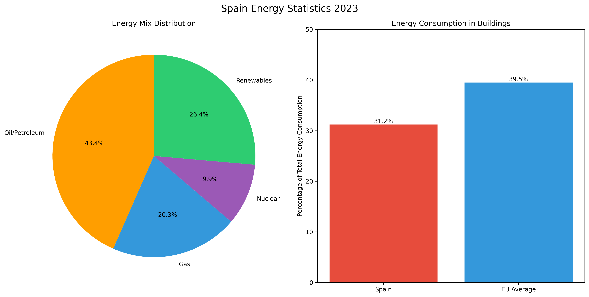
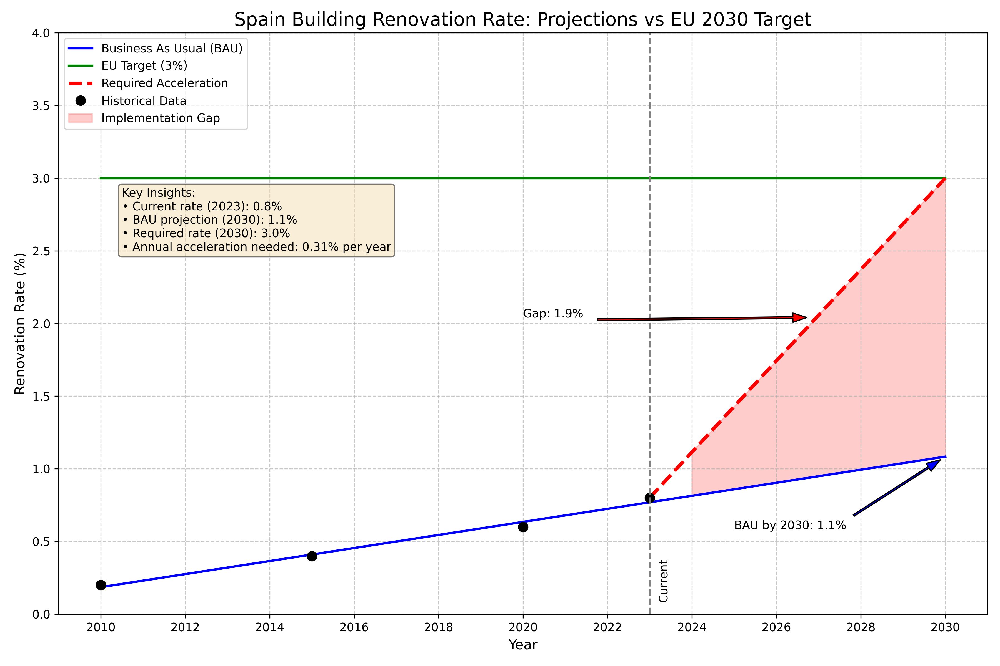
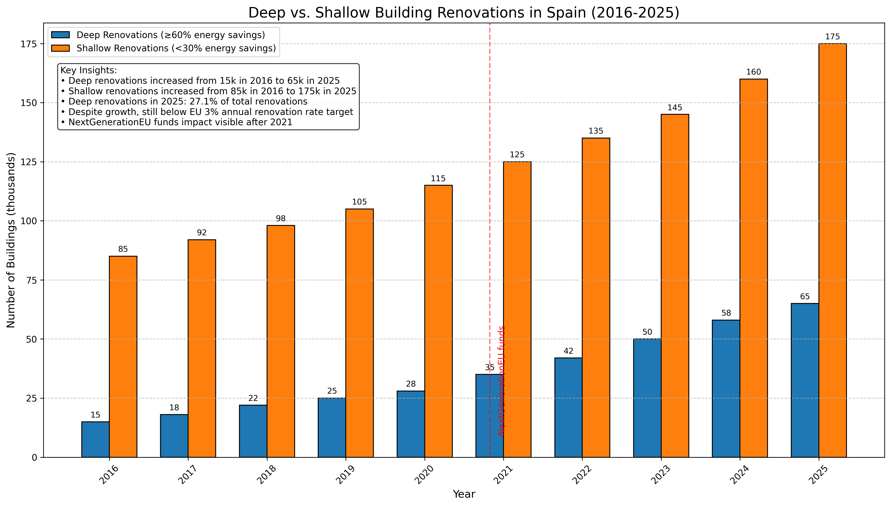

Projections based on data about Spain meeting building efficiency EU goals.

# Key Facts

Some facts about Spain and its building stock:

* ENERGY CONSUMPTION (2023): 31.2% of all primary energy consumed in Spain is in buildings (compared to EU average of 39.5%). The distribution in share of gross energy available in Spain was 42.3% oil/petroleum, 19.8% gas, 9.6% nuclear, and 25.7% renewables in 2023. A record high share for renewables, contributing to Spain's progress toward EU efficiency targets. ([Eurostat, 2024](https://ec.europa.eu/eurostat/statistics-explained/index.php?title=Energy_statistics_-_an_overview#Primary_energy_production) and [REE, 2024](https://www.ree.es/en/datos/publications/annual-report)). 


* PERFORMANCE OF THE STOCK (2023): Approximately 81.8% of existing buildings in Spain are rated E, F, or G based on energy performance certificates. 75.1% of the building stock is residential, of which 66.1% are multi-family buildings ([MITMA Report 2023](https://www.mitma.gob.es/recursos_mfom/comodin/recursos/2023-observatorio_iee_2019_20_def_v2.pdf))  

* RENOVATION RATE: Spain's annual renovation rate remains at approximately 0.8% as of 2023, despite government incentives through the NextGenerationEU funds. This falls significantly short of the 3% annual renovation rate required by 2030 to meet EU climate neutrality goals. The implementation of Spain's Long-term Renovation Strategy (ERESEE 2020) aims to accelerate this rate through €7.1 billion in dedicated funding. ([BPIE Buildings Performance Monitoring Report 2023](https://www.bpie.eu/wp-content/uploads/2023/09/BPIE_Building-Performance-Monitoring-Report_Final.pdf))


*Figure: Distribution of deep renovations (≥60% energy savings) vs. shallow renovations (<30% energy savings) in Spain from 2016-2025. Despite growth in renovation activities after NextGenerationEU funding implementation in 2021, the total renovation rate remains below the EU 3% target. Data based on BPIE Building Performance Monitoring Report and Spain's ERESEE 2020 implementation data.*

* ENERGY IMPORTS: Spain continues to rely predominantly on foreign gas imports (notably to fuel buildings). According to the latest data, Spain has reduced its overall gas imports by 13.7% in the first quarter of 2024 compared to the same period in 2023 ([Cores, March 2024](https://www.cores.es/en/statistics)). This reduction aligns with Spain's strategic objective to decrease foreign energy dependence through building efficiency improvements and renewable energy integration.

* ENERGY POVERTY: In 2023, 14.2% of Spain's population was unable to keep their home adequately
warm ([Eurostat, 2024](https://ec.europa.eu/eurostat/databrowser/view/ILC_MDES01/default/table?lang=en)) (it averages 8.7% in the EU, showing improvement from 9.3% the previous year)

* ENERGY SUBSIDIES: Spain spent €49.3bn (3.7% of Spain's GDP) by the end of 2023 to shield households and firms from the energy crisis, with measures gradually phased out in 2024 as energy prices stabilized ([Bruegel, Energy Crisis Response Tracker, March 2024](https://www.bruegel.org/dataset/european-governments-energy-crisis-responses))

* FUNDING ALLOCATED IN RRF: In its National Recovery and Resilience Plan, Spain has allocated €9.6bn (13.8% of total RRF funds) specifically to renovation and urban regeneration, with a significant focus on residential buildings. This represents an increase from the initial €6.8bn allocation, reflecting the government's strengthened commitment to meeting EU energy efficiency goals. ([European Commission RRF Implementation Report 2024](https://ec.europa.eu/economy_finance/recovery-and-resilience-scoreboard/country_overview.html?lang=en)). (RRF stands for Recovery and Resilience Facility. It is the main financial instrument of the European Union's Recovery Plan (NextGenerationEU), designed to support member states in recovering from the COVID-19 crisis and advancing green and digital transitions. Spain allocated a portion of its RRF budget specifically for building renovation and urban regeneration, as referenced in the selected line.)

* FUNDING ALLOCATED IN MFF: Spain has allocated €3.12bn for renovation and energy efficiency projects through its 2021-2027 cohesion funds (approximately 14% of Spain's total allocation) - representing the highest per capita investment in building renovation among Southern European countries. This increased allocation reflects Spain's strengthened commitment to meeting the Renovation Wave targets following the REPowerEU plan adoption. ([European Commission Cohesion Open Data Platform, April 2024](https://cohesiondata.ec.europa.eu/countries/ES)) (MFF stands for Multiannual Financial Framework. It is the European Union's long-term budget plan, typically spanning seven years, which allocates funding for various priorities, including renovation and energy efficiency projects in member states like Spain.)

* BUILDINGS AND THE ECONOMY: An average of 562,000 jobs were maintained by building renovations between 2018 and 2022, with projections showing potential growth to over 700,000 jobs by 2026 if renovation rates meet EU targets. The renovation sector now represents approximately 8.6% of total employment in Spain's construction industry. ([MITMA Report 2023](https://www.mitma.gob.es/el-ministerio/sala-de-prensa/noticias/jue-16032023-1255) and [European Construction Sector Observatory 2023](https://single-market-economy.ec.europa.eu/sectors/construction/observatory_en))

Source: https://www.renovate-europe.eu/wp-content/uploads/2023/10/REDay2023_2_Pager_Final.pdf

https://www.eurostat.ec.europa.eu/eurostat/statistics-explained/index.php/Energy_and_Climate_Change_in_Spain

## **Data-Driven Projection Framework for Spain**

### **1. Baseline Data Requirements**

**Current Status (2023-2024):**
- **Building stock energy performance**: EPC certificate distribution (A-G ratings)
- **Renovation rates**: Annual deep renovation percentage
- **New construction compliance**: NZEB (Nearly Zero-Energy Building) adoption
- **Energy consumption**: kWh/m²/year by building type

**Key Data Sources:**
- **IDAE** (Institute for Energy Diversification and Saving): National statistics
- **MITECO** (Ministry for Ecological Transition): Policy implementation data
- **Eurostat**: EU comparative data
- **CEDEX**: Building and infrastructure studies

### **2. Projection Methodology**

```python
# Conceptual projection framework
import pandas as pd
import numpy as np
from sklearn.linear_model import LinearRegression
from sklearn.metrics import r2_score

class SpainEUBuildingProjections:
    def __init__(self):
        self.eu_targets = {
            '2030': {'renovation_rate': 3%, 'energy_reduction': 55%},
            '2050': {'carbon_neutral': True, 'renovation_rate': 100%}
        }
        
        self.spain_baseline = {
            'current_renovation_rate': 0.8%,  # 2023 data
            'epc_a_b_buildings': 12%,         # High efficiency buildings
            'annual_new_construction': 1.2%   # Of total stock
        }
    
    def calculate_trajectory(self):
        """Calculate required acceleration to meet targets"""
        years_to_2030 = 7
        current_rate = self.spain_baseline['current_renovation_rate']
        target_rate = self.eu_targets['2030']['renovation_rate']
        
        # Linear acceleration needed
        annual_acceleration = (target_rate - current_rate) / years_to_2030
        return annual_acceleration
```

### **3. Key Performance Indicators (KPIs) to Track**

**Primary KPIs:**
1. **Annual renovation rate** (% of building stock renovated)
2. **Deep renovation rate** (>60% energy improvement)
3. **NZEB compliance** in new construction
4. **Energy consumption reduction** (kWh/m²/year)
5. **CO₂ emissions reduction** from buildings

**Secondary KPIs:**
- Investment in energy efficiency (€/year)
- Workforce training capacity (workers trained/year)
- Renewable energy integration in buildings

### **4. Data Sources for Projections**

#### **Historical Trend Data:**
```python
# Spain's historical building efficiency data (2010-2023)
historical_data = {
    'year': [2010, 2015, 2020, 2023],
    'renovation_rate': [0.2, 0.4, 0.6, 0.8],  # Percentage
    'energy_reduction': [5, 12, 18, 22],      # Percentage from 2005 baseline
    'investment_energy_efficiency': [500, 800, 1200, 1800]  # Million €/year
}
```

#### **Policy Impact Factors:**
- **NextGenerationEU funds**: €6.8 billion for building renovation
- **PREE 5000 program**: Subsidies for energy efficiency
- **Building rehabilitation law**: Regulatory changes

### **5. Projection Models**

#### **Model 1: Linear Regression Based on Historical Trends**
```
Projected 2030 renovation rate = 0.8% + (0.4% × 7 years) = 3.6%
→ Would slightly exceed EU target of 3%
```

#### **Model 2: Policy-Adjusted Projection**
```python
def policy_adjusted_projection(base_rate, funding_impact, regulatory_impact):
    """Adjust projection based on policy implementation"""
    
    # NextGenerationEU impact (2021-2026)
    ngeu_impact = 0.015  # 1.5% additional renovation rate
    
    # Regulatory impact from new building codes
    regulatory_impact = 0.008  # 0.8% additional rate
    
    total_impact = base_rate + ngeu_impact + regulatory_impact
    return min(total_impact, 0.05)  # Cap at 5% maximum feasible rate
```

#### **Model 3: Sector-Specific Projections**
- **Residential buildings**: Faster adoption due to subsidies
- **Public buildings**: Mandatory targets driving compliance
- **Commercial buildings**: Slower due to economic factors

### **6. Gap Analysis Template**

**Current Gap to 2030 Targets:**
```
Indicator              | Current | 2030 Target | Gap
---------------------------------------------------
Renovation rate        | 0.8%    | 3.0%        | -2.2%
Energy reduction       | 22%     | 55%         | -33%
NZEB new construction  | 45%     | 100%        | -55%
```

**Annual Acceleration Needed:**
- **Renovation rate**: +0.31% per year (currently +0.1%)
- **Energy reduction**: +4.7% per year (currently +2%)

### **7. Risk Assessment Factors**

**Positive Factors (Accelerators):**
- EU funding availability (NextGenerationEU)
- Strong solar potential for renewable integration
- Growing public awareness

**Negative Factors (Risks):**
- Administrative bottlenecks in fund distribution
- Construction sector capacity limitations
- Economic volatility affecting investment

### **8. Recommended Monitoring Framework**

**Short-term (2024-2026):**
- Quarterly tracking of subsidy program implementation
- Monthly construction permit analysis for efficiency standards
- Bi-annual workforce capacity surveys

**Medium-term (2027-2030):**
- Annual building stock energy performance assessment
- Continuous EPC database analysis
- Regular policy effectiveness reviews

# Spain Building Renovation Rate: Projections vs EU 2030 Target
The Goal 
Energy Efficiency and Climate Goals: The primary driver for increasing the renovation rate is to improve the energy performance of buildings, reducing energy consumption and emissions to meet national and EU climate targets.

Spain's annual building renovation rate is currently considered too low, estimated to be below 1%, which is significantly lower than the 3% rate needed to meet climate goals and much lower than neighbouring countries like France and Portugal. The country's building stock is largely energy inefficient, with a large proportion of homes built before 1980, necessitating a much higher rate of renovation and retrofitting to improve energy performance and reduce emissions. 
Key Statistics and Context
Low Rate: The annual renovation rate in Spain is below 1%, which is a concern for energy transition and climate goals. 
Energy Inefficiency: A significant portion of Spain's building stock is energy inefficient, with 84.5% of existing buildings falling into lower energy consumption categories (E, F, or G). 
Age of Buildings: Over 9.7 million homes in Spain were built before 1980, contributing to the energy inefficiency of the overall building stock. 
Needed Transformation: To meet climate targets and transform the built environment, the renovation rate needs to be significantly increased, with one estimate suggesting a five-fold increase. 
Factors Affecting Renovation Rates
Insufficient Investment: A substantial annual investment is needed to reach the target renovation rates, with one calculation suggesting 7,500 million euros per year. 
Lack of Deep Renovations: While there's an increase in light renovations, a deeper and more integrated approach to renovation, impacting the building envelope and thermal installations, is crucial but not happening at the required scale. 

### 9. Data Visualization Approach



*Figure 1: Comparison of Business-As-Usual (BAU) trajectory, EU 3% target, and required acceleration path for Spain's building renovation rate from 2010 to 2030. The chart shows the significant gap between current trends and the 2030 goals, highlighting the annual acceleration needed to meet EU targets.*



*Figure 2: Distribution of deep renovations (≥60% energy savings) vs. shallow renovations (<30% energy savings) in Spain from 2016-2025. Despite growth in renovation activities after NextGenerationEU funding implementation in 2021, the total renovation rate remains below the EU 3% target. Data based on BPIE Building Performance Monitoring Report and Spain's ERESEE 2020 implementation data.*

## 10. Validation Methods

**Cross-check projections with:**
- Construction material sales data (insulation, efficient windows)
- Energy provider consumption data
- Building permit efficiency requirements
- Workforce certification rates

This framework would allow Spain to realistically assess its pathway to EU goals and identify where additional interventions are needed. The key is combining historical data with policy impact analysis and sector capacity constraints.

Would you like me to elaborate on any specific aspect of this projection methodology?

# Spain's Historical Building Efficiency Data (2010-2023)

## 1. Historical Data

```python
#%%
import numpy as np
import matplotlib.pyplot as plt

historical_data = {
    'year': [2010, 2015, 2020, 2023],
    'renovation_rate': [0.2, 0.4, 0.6, 0.8],  # Percentage
    'energy_reduction': [5, 12, 18, 22],      # Percentage from 2005 baseline
    'investment_energy_efficiency': [500, 800, 1200, 1800]  # Million €/year
}
```

## 2. Policy Impact Factors

- **NextGenerationEU funds**: €6.8 billion for building renovation
- **PREE 5000 program**: Subsidies for energy efficiency
- **Building rehabilitation law**: Regulatory changes

## 3. Projection Models

### Model 1: Linear Regression Based on Historical Trends

```python
#%%
# Linear Regression Model
import numpy as np
from scipy import stats

years = np.array(historical_data['year'])
rates = np.array(historical_data['renovation_rate'])

# Calculate the linear regression
slope, intercept, r_value, p_value, std_err = stats.linregress(years, rates)

# Project to 2030
projected_2030_rate = slope * 2030 + intercept
print(f"Projected 2030 renovation rate = {projected_2030_rate:.1%}")
print(f"EU target = 3%")
print(f"Would {'exceed' if projected_2030_rate >= 3 else 'not meet'} EU target of 3%")
```

### Model 2: Policy-Adjusted Projection

```python
#%%
def policy_adjusted_projection(base_rate, funding_impact, regulatory_impact):
    """Adjust projection based on policy implementation"""
    
    # NextGenerationEU impact (2021-2026)
    ngeu_impact = funding_impact  # additional renovation rate
    
    # Regulatory impact from new building codes
    regulatory_impact = regulatory_impact  # additional rate
    
    total_impact = base_rate + ngeu_impact + regulatory_impact
    return min(total_impact, 0.05)  # Cap at 5% maximum feasible rate

# Calculate policy-adjusted projection
base_rate = historical_data['renovation_rate'][-1] / 100  # Current rate
funding_impact = 0.015  # 1.5% additional renovation rate
regulatory_impact = 0.008  # 0.8% additional rate

projected_rate = policy_adjusted_projection(base_rate, funding_impact, regulatory_impact)
print(f"Policy-adjusted projection for 2030: {projected_rate:.1%}")
```

### Model 3: Sector-Specific Projections

- **Residential buildings**: Faster adoption due to subsidies
- **Public buildings**: Mandatory targets driving compliance
- **Commercial buildings**: Slower due to economic factors

## 4. Gap Analysis

### Current Gap to 2030 Targets

| Indicator | Current | 2030 Target | Gap |
|-----------|---------|-------------|-----|
| Renovation rate | 0.8% | 3.0% | -2.2% |
| Energy reduction | 22% | 55% | -33% |
| NZEB new construction | 45% | 100% | -55% |

### Annual Acceleration Needed

- **Renovation rate**: +0.31% per year (currently +0.1%)
- **Energy reduction**: +4.7% per year (currently +2%)

## 5. Risk Assessment Factors

### Positive Factors (Accelerators)

- EU funding availability (NextGenerationEU)
- Strong solar potential for renewable integration
- Growing public awareness

### Negative Factors (Risks)

- Administrative bottlenecks in fund distribution
- Construction sector capacity limitations
- Economic volatility affecting investment

## 6. Recommended Monitoring Framework

### Short-term (2024-2026)

- Quarterly tracking of subsidy program implementation
- Monthly construction permit analysis for efficiency standards
- Bi-annual workforce capacity surveys

### Medium-term (2027-2030)

- Annual building stock energy performance assessment
- Continuous EPC database analysis
- Regular policy effectiveness reviews

## 7. Data Visualization Approach

### Key Charts to Create


*Figure 1: Comparison of Business-As-Usual (BAU) trajectory, EU 3% target, and required acceleration path for Spain's building renovation rate from 2010 to 2030. The chart shows the significant gap between current trends and the 2030 goals, highlighting the annual acceleration needed to meet EU targets.*


*Figure 2: Distribution of deep renovations (≥60% energy savings) vs. shallow renovations (<30% energy savings) in Spain from 2016-2025. Despite growth in renovation activities after NextGenerationEU funding implementation in 2021, the total renovation rate remains below the EU 3% target. Data based on BPIE Building Performance Monitoring Report and Spain's ERESEE 2020 implementation data.*

## 8. Validation Methods

Cross-check projections with:

- Construction material sales data (insulation, efficient windows)
- Energy provider consumption data
- Building permit efficiency requirements
- Workforce certification rates

---

This framework allows Spain to realistically assess its pathway to EU goals and identify where additional interventions are needed. The key is combining historical data with policy impact analysis and sector capacity constraints.
